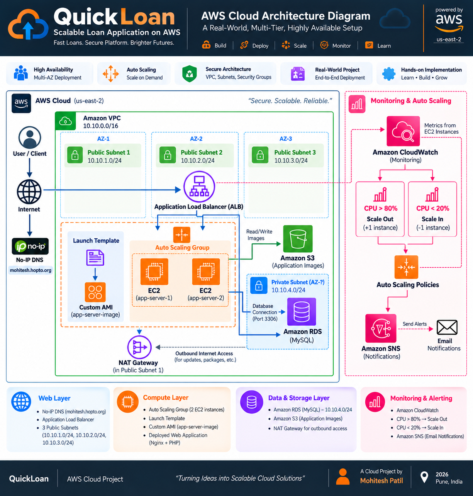

# 🚀 QuickLoan – Scalable Multi-Tier Loan Application on AWS

> A PHP-based loan application deployed on AWS using a scalable multi-tier architecture with Amazon EC2, Application Load Balancer, Auto Scaling, Amazon RDS, Amazon S3, VPC networking, CloudWatch, SNS, and IAM.

---

## 📌 Project Overview

**QuickLoan** is a web-based loan application deployed on **Amazon Web Services (AWS)**.

The application allows users to explore different loan products and submit loan applications through a web interface. The application is hosted using **Nginx and PHP-FPM**, with application data stored in **Amazon RDS for MySQL**.

The AWS infrastructure is designed around separate application and database layers, with additional AWS services used for traffic distribution, scalability, object storage, monitoring, and notifications.

### Key Objectives

* Deploy a PHP-based web application on AWS
* Separate application and database responsibilities
* Use Amazon RDS for managed MySQL database storage
* Use Amazon S3 for application image assets
* Distribute application traffic using an Application Load Balancer
* Maintain application capacity using an Auto Scaling Group
* Monitor infrastructure using Amazon CloudWatch
* Configure notifications using Amazon SNS
* Apply VPC networking and security controls
* Manage application source code using Git and GitHub

---
## 📘 Project Documentation

Explore the complete project documentation covering the AWS architecture, VPC networking, EC2 infrastructure, Application Load Balancer, Auto Scaling, RDS, S3, CloudWatch, SNS, and deployment details.

📄 **[View Complete AWS Project Documentation](QuickLoan_AWS_Cloud_Portfolio.pdf)**


## 🏗️ AWS Architecture

The following architecture represents the deployed QuickLoan AWS infrastructure, including VPC networking, Application Load Balancer, Auto Scaling, EC2 application servers, Amazon RDS, Amazon S3, CloudWatch monitoring, and SNS notifications.

<p align="center">
  
</p>

### Architecture Highlights

- **VPC:** Isolated AWS networking environment
- **Public Subnets:** Internet-facing infrastructure distributed across multiple Availability Zones
- **Application Load Balancer:** Distributes incoming application traffic
- **Auto Scaling Group:** Maintains application-server capacity
- **EC2:** Hosts the QuickLoan application using Nginx and PHP/PHP-FPM
- **Amazon RDS:** Managed MySQL database in the private layer
- **Amazon S3:** Stores application image assets
- **NAT Gateway:** Provides outbound connectivity for private resources
- **Amazon CloudWatch:** Infrastructure monitoring and CPU alarms
- **Amazon SNS:** Notifications associated with monitoring alarms
- **Launch Template + Custom AMI:** Provides the configuration used for Auto Scaling instances
```

---


# ☁️ AWS Services Used

| AWS Service                    | Role in the Project                                            |
| ------------------------------ | -------------------------------------------------------------- |
| **Amazon VPC**                 | Provides the isolated networking environment                   |
| **Amazon EC2**                 | Hosts the QuickLoan application                                |
| **Application Load Balancer**  | Distributes incoming traffic across application instances      |
| **Auto Scaling Group**         | Maintains and scales application-server capacity               |
| **Launch Template**            | Defines the configuration used to launch application instances |
| **Amazon Machine Image (AMI)** | Provides the base application-server configuration             |
| **Amazon RDS for MySQL**       | Provides the managed relational database                       |
| **Amazon S3**                  | Stores application image assets                                |
| **Amazon CloudWatch**          | Provides infrastructure monitoring and alarms                  |
| **Amazon SNS**                 | Delivers monitoring notifications                              |
| **AWS IAM**                    | Manages AWS identities and permissions                         |
| **Amazon EBS**                 | Provides block storage for EC2 instances                       |

---

# 🧩 Application Architecture

The application is organized into logical layers.

## 1. Presentation Layer

The frontend consists of:

* HTML
* CSS
* Application images

The main page presents the available loan products and provides access to the loan application form.

## 2. Application Layer

The application runs on Amazon EC2 using:

* Amazon Linux
* Nginx
* PHP
* PHP-FPM

Nginx handles HTTP requests while PHP processes the application logic.

## 3. Database Layer

Application data is stored in **Amazon RDS for MySQL**.

The PHP backend communicates with the database to process submitted loan applications.

## 4. Object Storage

Amazon S3 is used for application image assets, separating static objects from the EC2 application-server environment.

---

# 🔄 Application Request Flow

A typical application request follows this path:

```text
User
  │
  ▼
Application URL
  │
  ▼
Application Load Balancer
  │
  ▼
Healthy EC2 Application Instance
  │
  ▼
Nginx
  │
  ▼
PHP / PHP-FPM
  │
  ▼
Amazon RDS MySQL
  │
  ▼
Application Data
```

Static image assets are stored separately using Amazon S3.

---

# ⚖️ Load Balancing

The **Application Load Balancer (ALB)** provides a single entry point for application traffic.

Incoming requests are forwarded to application instances registered with the target group.

```text
                 Incoming Request
                        │
                        ▼
                ┌──────────────┐
                │     ALB      │
                └──────┬───────┘
                       │
                ┌──────┴──────┐
                ▼             ▼
          ┌──────────┐   ┌──────────┐
          │   EC2    │   │   EC2    │
          │ Instance │   │ Instance │
          └──────────┘   └──────────┘
```

This allows application traffic to be distributed across healthy backend instances.

---

# 📈 Auto Scaling

The application servers are managed using an **Auto Scaling Group**.

A configured application-server image and launch template provide the configuration required for launching application instances.

```text
Application Server Configuration
             │
             ▼
        Amazon AMI
             │
             ▼
      Launch Template
             │
             ▼
      Auto Scaling Group
             │
       ┌─────┴─────┐
       ▼           ▼
     EC2         EC2
   Instance    Instance
```

The Auto Scaling Group helps maintain the required application capacity and provides horizontal scaling capability.

---

# 🗄️ Database Architecture

The application uses **Amazon RDS for MySQL** as its managed relational database.

The database layer is separated from the EC2 application layer.

```text
┌─────────────────────────┐
│    EC2 Application      │
│       Servers           │
└────────────┬────────────┘
             │
             │ MySQL
             ▼
┌─────────────────────────┐
│       Amazon RDS        │
│          MySQL          │
└─────────────────────────┘
```

The application stores submitted loan application information in the database.

The PHP backend uses prepared SQL statements when inserting application data.

---

# 🖼️ Amazon S3

Amazon S3 is used for storing application image assets.

The QuickLoan application includes images for:

* Home Loan
* Gold Loan
* Vehicle Loan
* Personal Loan
* QuickLoan Logo

Using S3 for static assets separates object storage from the application-server filesystem.

---

# 🌐 AWS Networking

The application infrastructure is deployed within an **Amazon VPC**.

The networking design includes:

* VPC
* Public subnets
* Private subnets
* Route tables
* Internet Gateway
* Security Groups

The architecture separates internet-facing components from backend resources and controls communication using security-group rules.

---

# 🖥️ Server Roles

The deployment follows separate infrastructure responsibilities.

## Jump Server

The jump server provides an administrative access point for reaching internal infrastructure.

## Application Server

The application server hosts the QuickLoan application stack:

```text
Amazon Linux
     │
     ├── Nginx
     ├── PHP
     ├── PHP-FPM
     └── QuickLoan Application
```

## Database Layer

The database functionality is provided through Amazon RDS for MySQL.

---

# 🔐 Security

Security controls are applied at multiple layers.

### Network Security

Security Groups control permitted communication between infrastructure components.

### Database Isolation

The database is separated from the public-facing application layer and is not intended to be directly accessible from the public internet.

### Credential Protection

Database credentials are intentionally excluded from this public repository.

```text
includes/db_connect.php
```

is ignored using `.gitignore`.

> **Never commit database passwords, AWS access keys, private SSH keys, or other sensitive credentials to a public repository.**

---

# 📊 Monitoring

Amazon CloudWatch is used to monitor infrastructure metrics.

CloudWatch alarms can be configured to detect resource conditions such as high CPU utilization.

```text
EC2
 │
 ▼
CloudWatch Metrics
 │
 ▼
CloudWatch Alarm
 │
 ▼
SNS
 │
 ▼
Notification
```

This provides visibility into application-server resource utilization.

---

# 🔔 Notifications

Amazon SNS is used as the notification mechanism associated with monitoring alarms.

```text
EC2 Resource
     │
     ▼
CloudWatch
     │
     ▼
Alarm Condition
     │
     ▼
Amazon SNS
     │
     ▼
Notification
```

---

# 📁 Repository Structure

```text
QuickLoan-Scalable-Multi-Tier-AWS/
│
├── includes/
│   └── db_connect.php
│       └── Local database configuration
│           (excluded from GitHub)
│
├── nginx/
│   └── quickloan.conf
│       └── Nginx server configuration
│
├── public/
│   │
│   ├── images/
│   │   ├── quickloan_logo.png
│   │   ├── gold_loan.jpg
│   │   ├── vehicle_loan.jpg
│   │   ├── personal_loan.jpg
│   │   └── home_loan.jpg
│   │
│   ├── index.html
│   │   └── QuickLoan landing page
│   │
│   ├── styles.css
│   │   └── Application styling
│   │
│   ├── apply.php
│   │   └── Loan application form
│   │
│   └── submit_application.php
│       └── Application submission/database processing
│
├── .gitignore
└── README.md
```

---

# 🛠️ Deployment Workflow

The application deployment follows these major stages:

### 1. Application Preparation

Prepare the QuickLoan application files containing:

* HTML
* CSS
* PHP
* Images
* Nginx configuration

### 2. AWS Networking

Configure:

* VPC
* Subnets
* Route tables
* Internet Gateway
* Security Groups

### 3. Application Infrastructure

Configure EC2 application servers with:

* Amazon Linux
* Nginx
* PHP
* PHP-FPM

### 4. Database

Configure Amazon RDS for MySQL and establish the required database structure.

### 5. Static Assets

Upload application image assets to Amazon S3.

### 6. Load Balancing

Configure:

* Application Load Balancer
* Target Group
* Health checks

### 7. Auto Scaling

Create:

* AMI
* Launch Template
* Auto Scaling Group

### 8. Monitoring

Configure:

* CloudWatch metrics
* CloudWatch alarms
* SNS notifications

---

# 🧪 Validation & Testing

The deployed application can be validated through:

### Application

* Open the application endpoint
* Verify the QuickLoan landing page
* Verify loan-product sections
* Verify application images
* Open the loan application form
* Submit a test application

### Load Balancer

* Verify the ALB is active
* Verify the target group is healthy
* Verify application requests reach healthy instances

### Auto Scaling

* Verify desired, minimum, and maximum capacity
* Verify healthy EC2 instances
* Verify that the Auto Scaling Group maintains application capacity

### Database

* Verify application-to-RDS connectivity
* Submit a test application
* Verify the submitted record reaches the database

### Monitoring

* Verify CloudWatch metrics
* Verify configured alarms
* Verify SNS notifications

---

# 🧠 Key Technical Learnings

This project provided hands-on experience with:

* AWS VPC networking
* Public and private subnet architecture
* EC2 instance management
* Nginx configuration
* PHP and PHP-FPM deployment
* Amazon RDS for MySQL
* Amazon S3
* Application Load Balancer
* Target Groups
* Auto Scaling Groups
* Launch Templates
* AMIs
* CloudWatch monitoring
* SNS notifications
* IAM
* Security Groups
* Linux server administration
* Git and GitHub
* Multi-tier application architecture
* High availability and horizontal scalability concepts

---

# 🎯 Project Highlights

### Scalable Application Infrastructure

The application is deployed behind an Application Load Balancer and managed using an Auto Scaling Group.

### Managed Database

Amazon RDS provides the database layer instead of running the database directly on the application server.

### Cloud Object Storage

Amazon S3 provides storage for application image assets.

### Monitoring

CloudWatch provides infrastructure monitoring while SNS provides notifications for configured alarms.

### Network Separation

The AWS VPC and security groups provide controlled communication between application and backend resources.

### Secure Source Control

Sensitive database configuration is excluded from the public GitHub repository.

---

# 🔮 Future Improvements

The following are possible enhancements for a more production-oriented implementation:

* HTTPS using AWS Certificate Manager
* AWS WAF integration
* Centralized application logging
* AWS Secrets Manager for database credentials
* Infrastructure as Code using CloudFormation or Terraform
* Automated testing
* CI/CD pipeline
* Enhanced application observability

> These are **future improvements** and are not represented as currently implemented features of this project.

---

# 💡 Why This Project?

QuickLoan demonstrates the transition from a traditional web application to a cloud-based architecture.

Instead of relying on a single server, the project introduces AWS services for:

```text
Application Hosting
       +
Load Balancing
       +
Auto Scaling
       +
Managed Database
       +
Object Storage
       +
Monitoring
       +
Notifications
       +
Network Security
```

This provides practical experience with the core building blocks used when designing scalable web applications on AWS.

---

# 📚 Technologies

### Application

* HTML
* CSS
* PHP

### Web Server

* Nginx
* PHP-FPM

### Database

* MySQL

### Cloud Platform

* Amazon Web Services (AWS)

### Source Control

* Git
* GitHub

---

# 👨‍💻 Author

**Mohitesh Patil**

GitHub: [@mkpatil5](https://github.com/mkpatil5)

---

## ⭐ Project Summary

**QuickLoan – Scalable Multi-Tier Loan Application on AWS** demonstrates the deployment of a PHP-based web application using AWS infrastructure designed around scalability, traffic distribution, managed database services, object storage, monitoring, and controlled network communication.

The project combines application development with practical AWS infrastructure management and provides hands-on experience with deploying and operating a cloud-based web application.
